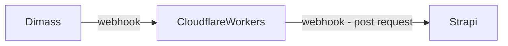

# Cloudflare & Dimass webhook

This cloudflare worker is a webhook that listens to incoming requests from the webhook from dimass.

## URLS used

### **Strapi CMS**

- `https://${BASE_URL}/api/${CONTENT_TYPE}`

### **CloudFlareWorker: dilmahtea-me-dimass-webhook**

- `https://dimass-webhook.scripts.dilmahtea.me`

## Data flow

_I hope mermaid charts works on github; preview doesn't seem to work on vscode_

Dimass-webhook (DiW) listens to the event of a stock update, DiW sends update to the CloudFlareWorker (CFW) which then sends a POST request to the STRAPI (CMS) API and updates the content used on the website (ASTRO).

## References

1. [Cloudflare Workers](https://developers.cloudflare.com/workers/)
   **Dimass**
2. [Dimass - SupportPlaza - Webhooks Introduction](https://developer.supportplaza.nl/webhooks/introduction.html)

3. [Mermaid graphs](https://mermaid.js.org/)
